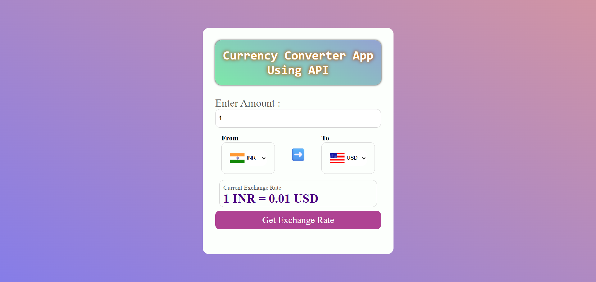

## 💱 Currency Converter App

- A simple and responsive currency converter web application built with **HTML**, **CSS**, and **JavaScript**, using a live **exchange rate API**. Users can convert amounts between two currencies with real-time exchange rates and country flags.


---

## ✨ Features

- Convert between over 100 currencies using live exchange rates  
- Pre-selected default (INR ➡ USD) with flag display  
- Automatic flag updates based on selected currencies  
- Responsive layout with a clean UI and gradient background  
- Uses [Fawaz Ahmed's free currency API](https://github.com/fawazahmed0/currency-api)  

---

## 📁 File Structure

| File                 | Description                                |
|----------------------|--------------------------------------------|
| `CurrencyConverApp.html` | Main HTML layout for the app               |
| `currencycss.css`        | Styling for layout, inputs, buttons, etc. |
| `mainapp.js`             | Core JS logic for fetching & converting   |
| `countryList.js`         | Currency-to-country mapping for flags     |


## 🚀 How to Run the Project

### 📦 Prerequisites

- A modern web browser (e.g., Chrome, Firefox, Edge)
- Code editor (optional, e.g., Visual Studio Code)
- Git (optional, for cloning the repository)

### 🛠️ Steps to Run

### 1.Clone the Repository
   ```bash
   git clone https://github.com/PratimaPanigrahi/API_Currencyconvertor.git
   ```

### 2.Open the Project

- Open the folder in any code editor

### 3. Run in Browser
- Simply open the index.html file in your browser.

---


## 🖼️ Screens Overview

### 1. 🏁 Start Page [Screenshot]
- Enter an amount, choose currencies, and click Get Exchange Rate


---

## 📘 What I Learned

- Created a live currency converter using public API data
- Dynamically generated dropdowns with country flags
- Validated user input and handled empty values
- Built a fully responsive, user-friendly interface

---

 ### 📬 Contact
- For any queries or contributions, feel free to open an issue or submit a pull request.
